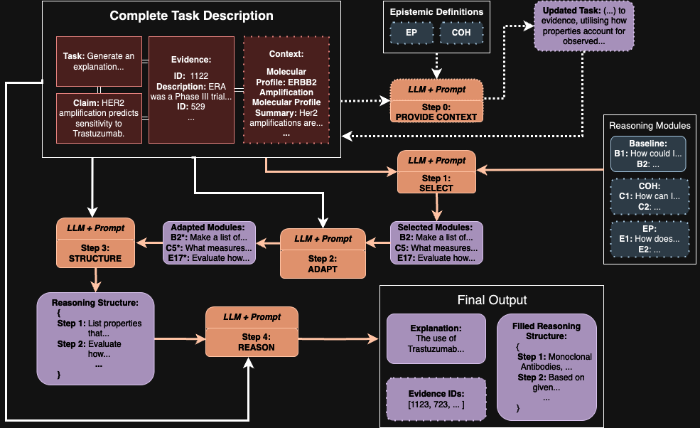
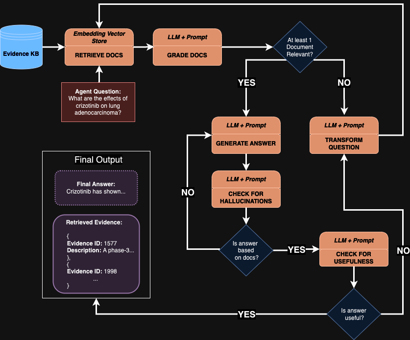
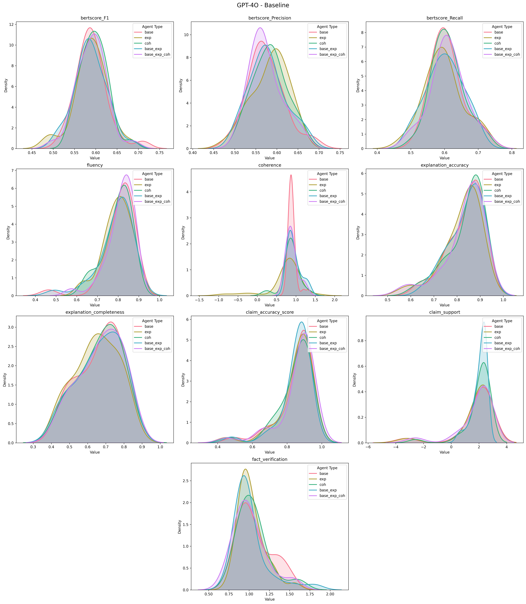
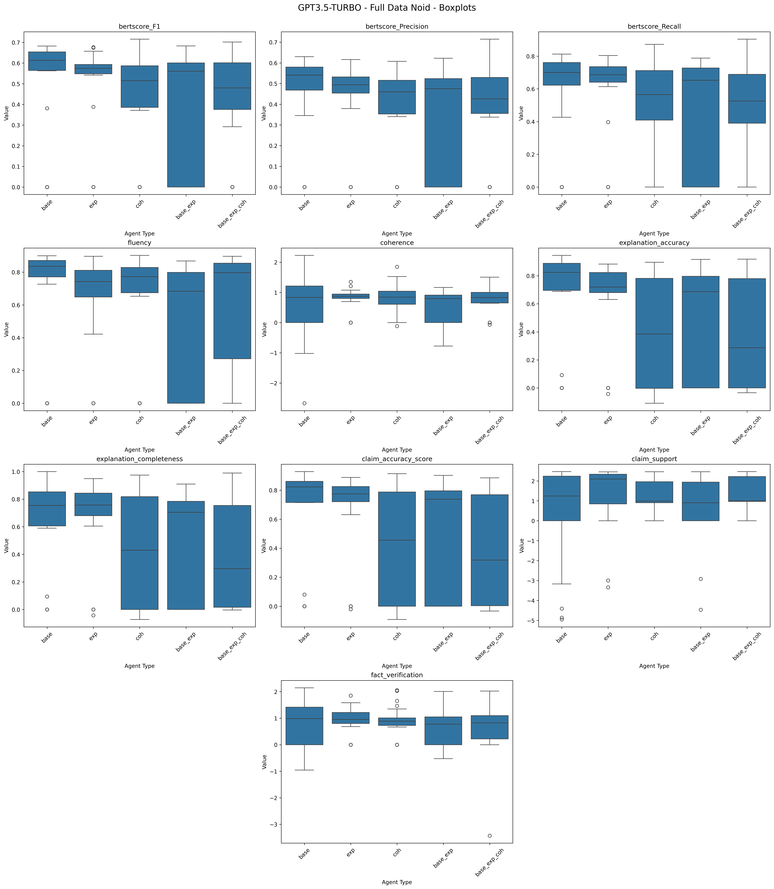
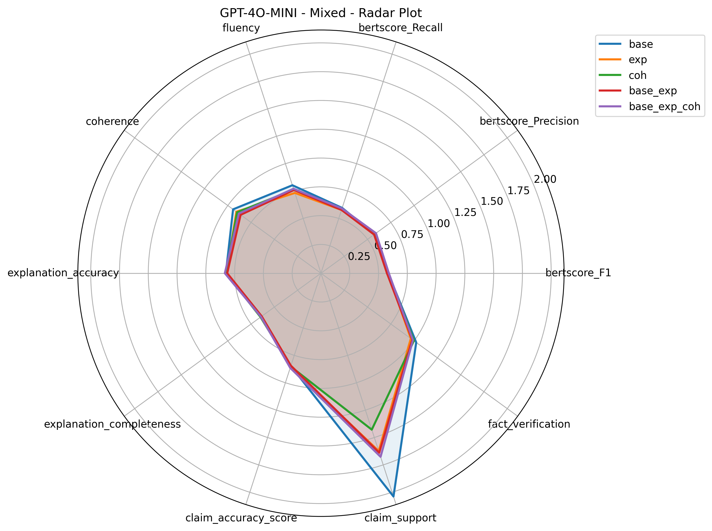
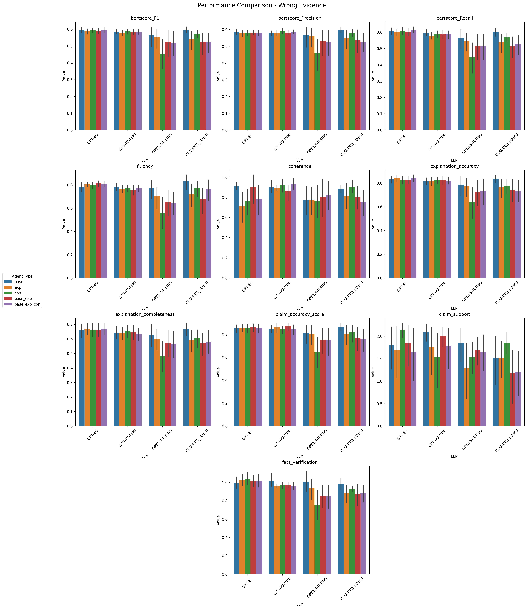
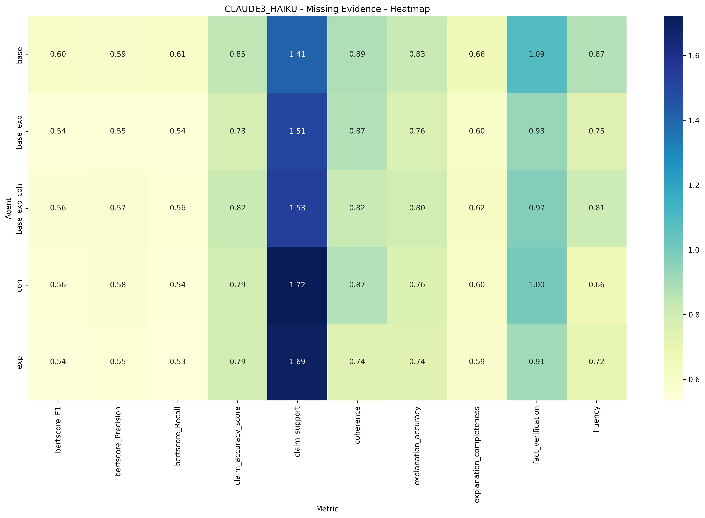
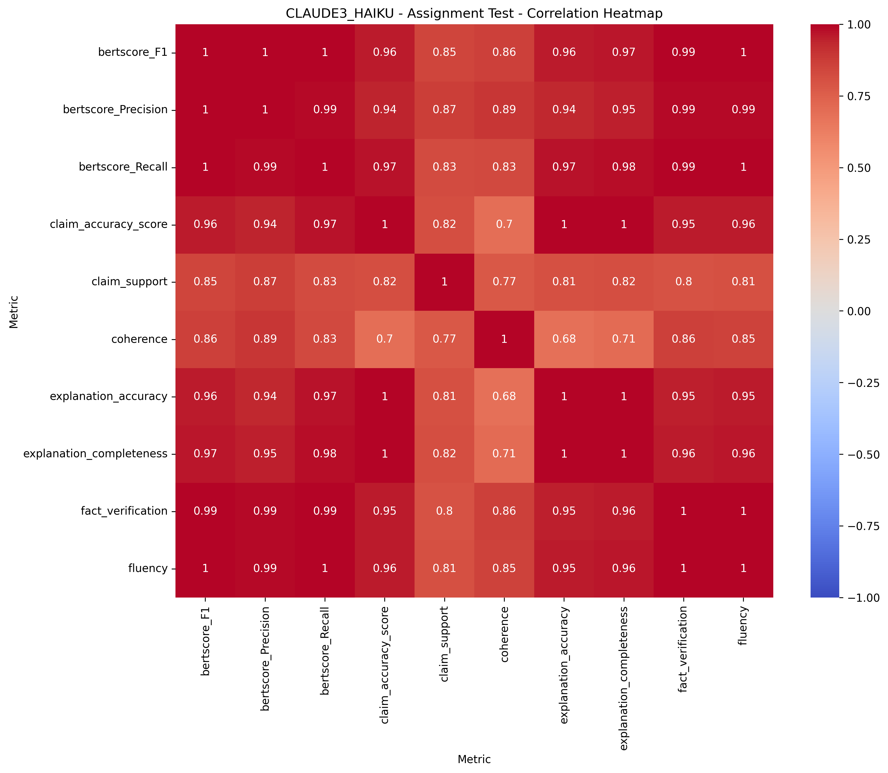

# DATA72000-IBE - Explanatory & Coherence guided LLM Reasoning

**Author**: Radoslaw Kamil Izak  
**Contact**: [izakradoslaw@gmail.com](mailto:izakradoslaw@gmail.com)

**Project Supervisor**: Dr. André Freitas  
**Contact**: [andre.freitas@manchester.ac.uk](mailto:andre.freitas@manchester.ac.uk)  
**Website**: [andrefreitas.net](https://www.andrefreitas.net/)


## Table of Contents

1. [Project Overview](#project-overview)
2. [Installation](#installation)
3. [Repository Structure](#repository-structure)
4. [Usage](#usage)
5. [Results](#results)
6. [Code Attribution](#code-attribution)
7. [References](#references)
8. [License](#license)

## Project Overview

### General Summary

This repository contains the code for the Extended Research Project (`ERP/DATA72000`) module for the academic year 2023-2024 at The University of Manchester. The project focused on enhancing the explanatory capabilities of large language models (`LLMs`) by integrating Explanatory Power (`EP`) and Coherence (`COH`) modules into a state-of-the-art (`SOTA`) framework, in turn advancing LLM inference-based reasoning by enabling more informed and controlled explanation generation. As such, the inclusion of EP and COH modules generally improved the LLMs' abilities regarding evidence-based inference. However, when presented with too much information, LLMs still tended to hallucinate or confuse information.

### Motivation

LLMs currently have limited abilities to perform complex inference, such as scientific reasoning. Epistemology, particularly analytical philosophy, has formalized various aspects of inference. These notions can be used to develop modules that guide models in selecting, gathering, and utilizing evidence more effectively, resulting in higher-quality explanations for given claims.


### Key Questions

This project addresses several key questions:

- **Impact on Explanation Quality:** How does the inclusion of EP and COH modules affect the quality of explanations generated by LLMs across different evidence scenarios?
- **Evidence Handling:** In what ways do EP and COH notions affect the evidence selection, gathering, and utilization processes in LLMs during explanation generation?
- **Accuracy and Alignment:** What are the relative contributions of EP and COH to improving the factual accuracy and alignment with evidence in explanations generated by LLMs?
- **Evidence Differentiation:** How does the presence of EP and COH modules affect the ability of LLMs to differentiate and select appropriate evidence for multiple claims in combined evidence scenarios?

### Proposed Approach

This project adapted and tested the [`Self-Discover`](https://arxiv.org/pdf/2402.03620) framework across several evidence-claim scenarios to enhance the explanatory capabilities of large language models (`LLMs`). The approach utilized `formally guided Chain-of-Thought (fgCoT)` mechanisms to support the construction of explanations based on supporting evidence. Two key epistemological notions were integrated into the model to achieve this:

1. **Explanatory Power (EP):** Focuses on the strength of explanations and their ability to clarify and justify claims.
2. **Coherentist Models (CM):** Emphasizes the coherence of explanations by ensuring that all components logically support each other.

Moreover, for some tested scenarios, an instance of slightly modified [`Self-RAG`](https://arxiv.org/pdf/2310.11511) agent was applied across all relevant tests. This agent was used in cases where portions of available evidence were missing. Please, refer to the main `report.pdf` for more information.

### Baselines and Comparisons

To evaluate the effectiveness of the proposed approaches, the following were tested on GPT-4o, GPT-4o-mini, GPT-3.5 Turbo, and Claude3 Haiku:

- **Plain LLMs with Baseline Modules:**
    - **Enhanced with EP Modules** 
    - **Enhanced with EP + COH Modules** 
- **Plain LLMs with EP Modules**
- **Plain LLMs with COH Modules**

## Installation


### Requirements
- **Python Version** `Python 3.10.13`
- **Dependencies**: see `requirements.txt`

> ***Note***: The code was ran and tested on `macOS Sonoma 14.6.1`. It should work *as is* on any `Unix/Linux` based system. The author cannot guarantee the code working on `Windows` machines.

### Setup

1. **Clone the Repository**:
    ```bash
    git clone https://github.com/rk-izak/DATA72000-IBE.git
    ```
2. **Navigate to the Project Directory**:
    ```bash
    cd DATA72000-IBE
    ```
3. **Create a Virtual Environment**:
    ```bash
    python3 -m venv env
    ```
4. **Activate the Virtual Environment**:
   - On macOS and Linux:
     ```bash
     source env/bin/activate
     ```
   - On Windows:
     ```bash
     .\env\Scripts\activate
     ```
5. **Install Dependencies**:
    ```bash
    pip install -r requirements.txt
    ```

> ***Note***: The created `env` should be used across all `Jupyter Notebooks` within the repository.

## Repository Structure

A brief overview of the repository contents:

- **`LICENSE`**: Contains the licensing information for the project.
- **`README.md`**: This README file, providing an basic overview and instructions.
- **`report.pdf`**: The main report generated for this project.
- **`requirements.txt`**: A text file listing all Python3 dependencies required to run the scripts.
- **`data/`**: Directory for all raw and processed data files used for this project.
- **`figures/`**: Contains results visualizations, plots, tables, and other graphical outputs generated (such as agent architectures) for this project, alongside the notebooks used to create them.
- **`models/`**: Directory where model architecture files (`Self-RAG` and `Self-Discover`) and model configurations are stored, as well as reasoning modules.
- **`outputs/`**: Contains extracted raw textual outputs generated by tested LLMs/Agents architectures for different tasks, alongside the notebooks used for running the tests for different agents/LLMs.
- **`results/`**: Directory for storing numerical results based on defined metrics - basically `outputs/*` but processed through metrics and relevant notebooks found within the folder.
- **`utils/`**: Contains utility scripts, helper functions, evaluation metrics + unit tests, automatic tester, and basic interactive playground for agents.

> ***Note***: Each folder contains their own `README.md` file focused on the respective contents. For more information on specifics usage or otherwise, please check them first.

## Usage

To use the contents of this repository, navigate to the folder that corresponds to your exact need:

- **`Generating Raw Textual Outputs`**: If you want to run scripts and generate new outputs for different Architecures and/or LLMs, navigate to the `outputs/` directory. This folder contains all relevant scripts/notebooks and documentation to help you execute tasks automatically and store results.
- **`Checking and/or Modifying Architectures`**: To explore the agent architectures used in this project, such as `Self-RAG` and `Self-Discover`, refer to the `models/` directory. You will find architecture files, reasoning modules, and related documentation.
- **`Viewing Raw/Clean Data`**: The `data/` directory contains all raw and processed data files used in this project for both `CIViC DB` and `R4C` cases. It also contains relevant scripts/notebooks used in the process. Check there for raw data and pre-processed data ready for testing.
- **`Examining Results`**: For the processed results and evaluations based on metrics defined in `utils/`, go to the `results/` directory. This folder includes numerical results derived from the textual outputs generated by the agents, as well as notebooks used for the evaluation purposes.
- **`Visualizations and Figures`**: All visualizations, plots, tables, and other graphical outputs based on aggregated metrics from `results/` folder can be found in the `figures/` directory, alongside scripts used to create them.
- **`Eval. Metrics, Utilities, and Testing`**: The `utils/` folder contains utility scripts, helper functions, evaluation metrics, unit tests, automated tester, and an interactive playground for agents (`Self-RAG` and `Self-Discover`). Refer to this folder for additional information about these tools, utilities, and their usage.

For detailed usage instructions, again, please refer to the `README.md` file within each folder.


## Results

For brevity, this section includes examples from the `results/` folder to illustrate the expected formatting, as well as to showcase some notable results and figures.

### Architectures

---

<div align="center">
    
    <p><strong>Figure 1:</strong> Adapted Self-Discover workflow with reasoning modules</p>
</div>

---

<div align="center">
    
    <p><strong>Figure 2:</strong> Self-RAG Workflow</p>
</div>

---

### Tables

---

<div align="center">
<p><strong>Table 1: GPT-4O - Missing Evidence Test Averages</strong></p>

<table>
<tr>
<th>Metric</th><th>Base</th><th>EXP</th><th>COH</th><th>Base+EXP</th><th>Base+EXP+COH</th><th><strong>Relative Gain</strong></th>
</tr>
<tr><td>BERTScore (F1)</td><td><u>0.5946</u></td><td>0.5886</td><td><u>0.5946</u></td><td>0.5878</td><td>0.5917</td><td><strong>0.00%</strong></td></tr>
<tr><td>BERTScore (Precision)</td><td>0.5792</td><td>0.5767</td><td>0.5861</td><td>0.5722</td><td><u>0.5807</u></td><td><strong>1.19%</strong></td></tr>
<tr><td>BERTScore (Recall)</td><td><u>0.6131</u></td><td>0.6037</td><td>0.6059</td><td>0.6076</td><td>0.6072</td><td><strong>0.00%</strong></td></tr>
<tr><td>Fluency</td><td>0.7983</td><td><u>0.8066</u></td><td>0.7996</td><td><u>0.8189</u></td><td>0.7740</td><td><strong>2.58%</strong></td></tr>
<tr><td>Coherence</td><td><u>0.8515</u></td><td>0.8253</td><td>0.7953</td><td>0.7868</td><td>0.8089</td><td><strong>0.00%</strong></td></tr>
<tr><td>Explanation Accuracy</td><td>0.8313</td><td>0.8308</td><td><u>0.8324</u></td><td>0.8373</td><td><u>0.8405</u></td><td><strong>1.11%</strong></td></tr>
<tr><td>Explanation Completeness</td><td>0.6622</td><td>0.6634</td><td>0.6602</td><td>0.6671</td><td><u>0.6771</u></td><td><strong>2.25%</strong></td></tr>
<tr><td>Claim Accuracy</td><td>0.8483</td><td>0.8477</td><td><u>0.8510</u></td><td>0.8434</td><td>0.8490</td><td><strong>0.31%</strong></td></tr>
<tr><td>Claim Support</td><td>1.8774</td><td>1.7140</td><td>1.8164</td><td>1.7415</td><td><u>2.0106</u></td><td><strong>7.09%</strong></td></tr>
<tr><td>Fact Verification</td><td>1.0035</td><td>1.0278</td><td>0.9918</td><td><u>1.0439</u></td><td>1.0425</td><td><strong>4.02%</strong></td></tr>
</table>
</div>

---

<div align="center">
<p><strong>Table 2: GPT3.5-TURBO - Baseline Test Averages</strong></p>

<table>
<tr>
<th>Metric</th><th>Base</th><th>EXP</th><th>COH</th><th>Base+EXP</th><th>Base+EXP+COH</th><th><strong>Relative Gain</strong></th>
</tr>
<tr><td>BERTScore (F1)</td><td>0.5097</td><td>0.5409</td><td>0.4091</td><td>0.5112</td><td><u>0.5500</u></td><td><strong>7.91%</strong></td></tr>
<tr><td>BERTScore (Precision)</td><td>0.5158</td><td>0.5499</td><td>0.4191</td><td>0.5210</td><td><u>0.5589</u></td><td><strong>8.34%</strong></td></tr>
<tr><td>BERTScore (Recall)</td><td>0.5066</td><td>0.5344</td><td>0.4012</td><td>0.5038</td><td><u>0.5438</u></td><td><strong>7.33%</strong></td></tr>
<tr><td>Fluency</td><td>0.6242</td><td><u>0.7169</u></td><td>0.5228</td><td>0.6770</td><td>0.7071</td><td><strong>14.86%</strong></td></tr>
<tr><td>Coherence</td><td>0.8110</td><td>0.6757</td><td>0.6489</td><td>0.5018</td><td><u>0.8753</u></td><td><strong>7.92%</strong></td></tr>
<tr><td>Explanation Accuracy</td><td>0.6946</td><td><u>0.7477</u></td><td>0.5919</td><td>0.7141</td><td>0.7887</td><td><strong>13.56%</strong></td></tr>
<tr><td>Explanation Completeness</td><td>0.5461</td><td>0.5993</td><td>0.4455</td><td>0.5561</td><td><u>0.6077</u></td><td><strong>11.28%</strong></td></tr>
<tr><td>Claim Accuracy</td><td>0.7264</td><td>0.7692</td><td>0.6225</td><td>0.7436</td><td><u>0.7950</u></td><td><strong>9.44%</strong></td></tr>
<tr><td>Claim Support</td><td>1.6526</td><td>1.5675</td><td>1.1790</td><td><u>1.6814</u></td><td>1.6293</td><td><strong>1.74%</strong></td></tr>
<tr><td>Fact Verification</td><td>0.8975</td><td>0.8762</td><td>0.6495</td><td>0.8519</td><td><u>0.9216</u></td><td><strong>2.68%</strong></td></tr>
</table>
</div>

---

### Graphs

---

<div align="center">
    
    <p><strong>Figure 3:</strong> Density Plots for Evaluation Metrics for GPT-4O for all 5 tested Agents (Baseline Test)</p>
</div>

---

<div align="center">
    
    <p><strong>Figure 4:</strong> Boxplots for Evaluation Metrics for GPT3.5-Turbo for all 5 tested Agents (R4C Test)</p>
</div>

---

<div align="center">
    
    <p><strong>Figure 5:</strong> Radar plots for Evaluation Metrics for GPT-4O-Mini for all 5 tested Agents (Mixed Test)</p>
</div>

---

<div align="center">
    
    <p><strong>Figure 6:</strong> Performance Comparison across Evaluation Metrics for all LLMs, for all 5 tested Agents (Wrong Evidence Test)</p>
</div>

---

<div align="center">
    
    <p><strong>Figure 7:</strong> Heatmaps for Evaluation Metrics for Claude3 Haiku for all 5 tested Agents (Missing Evidence Test)</p>
</div>

---

<div align="center">
    
    <p><strong>Figure 8:</strong> Correlation Heatmaps for Evaluation Metrics for Claude3 Haiku for all 5 tested Agents (Assignment Test)</p>
</div>

---
> ***Note***: The figures/tables above ***might not*** be the exact ones found in the main report as they are complete representations of all data/metrics and are used for showcasing reasons rather than concise report writing.


## Code Attribution

This project incorporates and builds upon several key frameworks, models, and datasets:
- **`LangChain`**: Virtually all developed and tested architectures/agents were based on the [LangChain](https://www.langchain.com/) framework for efficient interactions with LLMs. More specifically, the [LangGraph](https://langchain-ai.github.io/langgraph/) library was used for creating agentic LLM workflows. For more information about usage and llm-solutions, please visit the linked websites.
- **`Self-Discover`**: The `Self-Discover` framework was used and adapted in this project. Specifically, an implementation based on [LangChain Tutorial](https://langchain-ai.github.io/langgraph/tutorials/self-discover/self-discover/) regarding `Agent Architectures` was used. This implementation, in turn, was based on [@catid's](https://github.com/catid/self-discover/tree/main?tab=readme-ov-file) repository. Please, visit them firsthand for better understanding. For more details on the development of original framework, please visit the [Self-Discover Paper](https://arxiv.org/pdf/2402.03620).
- **`Self-RAG`**: A slightly adjusted version of the `Self-RAG` agent was employed for scenarios where portions of available evidence were missing. This implementation ios based on [LangChain Tutorial](https://langchain-ai.github.io/langgraph/tutorials/rag/langgraph_self_rag/) regarding `Retrieval Augmented Generation`. For more information about this agent and to explore the original implementation, refer to the [Self-RAG paper](https://arxiv.org/pdf/2310.11511) or the `LangChain` website.
- **`CIViC Database`**: The data used for majority of tests in this project was retrieved from the [Clinical Interpretation of Variants in Cancer](https://civicdb.org/) knowledgebase, more specifically the [Assertions](https://civicdb.org/assertions/home) data alongside its supporting information. For more information regarding its original structure, usage, and origins, please visit the linked website.
- **`R4C Dataset`**: For additional tests regarding noisy-evidence, the [Right for Right Reasons RC (R4C)](https://naoya-i.github.io/r4c/) dataset was selected and appropriately modified for testing, alongside its counterpart [HotpotQA](https://hotpotqa.github.io/) dataset, on which it was built upon. Combined, these datsets served an important role of validating findings. For more information, please visit the linked websites.
- **`OpenAI/Anthropic LLMs`**: At the core of this project, the following LLMs were used: `GPT-4o`, `GPT-4o-mini`, `GPT3.5-Turbo`, and `Claude3 Haiku`, with the specific snapshots visible in the table below. For more information, please visit either [OpenAI](https://openai.com) or [Anthropic](https://www.anthropic.com/) webpages:


<div align="center">

| Model Snapshot            | Company  |
|-----------------------|----------|
| `gpt-4o-2024-08-06`   | OpenAI   |
| `gpt-4o-mini-2024-07-18`     | OpenAI   |
|  `gpt-3.5-turbo-0125` | OpenAI   |
| `claude-3-haiku-20240307` | Anthropic |

</div>

- **`HuggingFace`**: Several models from [HuggingFace](https://huggingface.co/) repositories were utilised for evaluation metrics. These models, alongside their usage and links, can be found in the table below:

<div align="center">

| Model Name                                                                 | Description                                    |
|----------------------------------------------------------------------------|------------------------------------------------|
| [sentence-transformers/all-mpnet-base-v2](https://huggingface.co/sentence-transformers/all-mpnet-base-v2) | Used for Sentence Similarity (Semantics) based Metrics |
| [tasksource/deberta-small-long-nli](https://huggingface.co/tasksource/deberta-small-long-nli) | Used for Natural Language Inference (NLI) based Metrics |
| [gpt2-medium](https://huggingface.co/openai-community/gpt2-medium)         | Used for Fluency Metric                        |
| [facebook/bart-large-mnli](https://huggingface.co/facebook/bart-large-mnli) | Used for BERTSCORE                             |


</div>


The author extends his gratitude to the authors of these frameworks, models, and datasets for their contributions to the field and for making their work available to the community.

> ***Note***: For all other used libraries (both core and minor), please refer to the [References](#references) section, specifically the `Libraries Used` subsection.

## References

### Epistemology
- [Coherentist Theories of Epistemic Justification](https://plato.stanford.edu/entries/justep-coherence/#ProMeaCoh)
- [How good is an explanation?n](https://link.springer.com/article/10.1007/s11229-022-04025-x)
- [Explanatory Models and Their Application](https://philpapers.org/archive/SCHEPM-2.pdf)
- [Experimental	Philosophy Meets Formal Epistemology](https://link.springer.com/article/10.1007/s11229-006-9055-7)
- [The Logic of Explanatory Power](https://iris.unito.it/bitstream/2318/1662636/2/Schupbach%20and%20Sprenger%202011%20Explanatory%20Power.pdf)
- [Mechanistic Explanation of Biological Processes](https://www.cambridge.org/core/journals/philosophy-of-science/article/mechanistic-explanation-of-biological-processes/42596A60DD0BF16C1EFC70771F574EE4)
- [The role of explanatory considerations in updating](https://philpapers.org/rec/DOUTRO-8)
- [Experimental Explication](https://www.jstor.org/stable/48578895?seq=1)

### Core Architectures
- [Self-RAG: Learning to Retrieve, Generate, and Critique through Self-Reflection](https://arxiv.org/pdf/2310.11511)
- [SELF-DISCOVER: Large Language Models Self-Compose Reasoning Structures](https://arxiv.org/pdf/2402.03620)

### Datasets
- [CIViCdb 2022: evolution of an open-access cancer variant interpretation knowledgebas](https://pubmed.ncbi.nlm.nih.gov/36373660/)
- [R4C: A Benchmark for Evaluating RC Systems to Get the Right Answer for the Right Reason](https://aclanthology.org/2020.acl-main.602/)
- [HotpotQA: A Dataset for Diverse, Explainable Multi-hop Question Answering](https://aclanthology.org/D18-1259/)

### LLMs
- [OpenAI: GPT-4o, GPT-4o-mini, GPT-3.5 Turbo](https://openai.com)
- [Anthropic: Claude 3 Haiku](https://www.anthropic.com/)

### Libraries Used
- [LangChain AI](https://github.com/langchain-ai/langchain)
- [Transformers: State-of-the-Art Natural Language Processing](https://arxiv.org/pdf/1910.03771)
- [Automatic differentiation in PyTorch](https://openreview.net/forum?id=BJJsrmfCZ)
- [Pandas](https://zenodo.org/records/3630805#.XjI9CyOIYdU)
- [Matplotlib: A 2D Graphics Environment](https://ieeexplore.ieee.org/document/4160265)
- [seaborn: statistical data visualization](https://joss.theoj.org/papers/10.21105/joss.03021)
- [Natural Language Toolkit (NLTK)](https://github.com/nltk/nltk)
- [Scikit-learn: Machine Learning in Python](https://jmlr.csail.mit.edu/papers/v12/pedregosa11a.html)
- [SciPy 1.0: Fundamental Algorithms for Scientific Computing in Python](https://scipy.org/)
- [Array programming with NumPy](https://www.nature.com/articles/s41586-020-2649-2)

> ***Note***: This is **NOT** a complete list of references used for the report and/or the project, but is instead a list of references most relevant to the information found within this repository.

## License

This project is licensed under the Apache License 2.0. You are free to use, modify, and distribute this software in compliance with the terms of the license. The full license text can be found in the `LICENSE` file included in this repository. Please review the `LICENSE` file for more detailed information on your rights and responsibilities. By using this code, you agree to adhere to the terms of the Apache-2.0 license.
