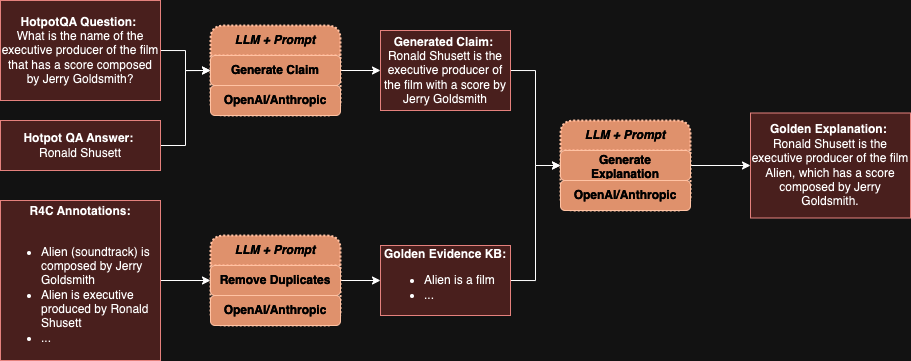

# DATA72000-IBE

## Overview

This README provides details about the contents of the `data` folder within this repository. The `data` folder is divided into two subfolders: `CIVIC` and `R4C`. Each subfolder contains raw data, cleaned data, and a Jupyter notebook used for preparing the raw data into clean formats. This `README` aims to briefly explain the structure of these subfolders, the purpose of the different files within them, and provides some examples for clarity.

## Folder Structure
```bash
data/
│
├── CIVIC/
│   ├── clean/
│   │   ├── context/
│   │   │   ├── assignment_test.json
│   │   │   ├── baseline.json
│   │   │   ├── missing_evidence.json
│   │   │   ├── mixed.json
│   │   │   ├── selection_test.json
│   │   │   ├── wrong_claim.json
│   │   │   └── wrong_evidence.json
│   │   ├── no_context/
│   │   │   └── (same file structure as in context/)
│   ├── raw/
│   │   ├── 01-Aug-2024-AssertionSummaries.tsv
│   │   ├── 01-Aug-2024-ClinicalEvidenceSummaries.tsv
│   │   ├── 01-Aug-2024-GeneSummaries.tsv
│   │   ├── 01-Aug-2024-MolecularProfileSummaries.tsv
│   │   ├── 01-Aug-2024-VariantGroupSummaries.tsv
│   │   ├── 01-Aug-2024-VariantSummaries.tsv
│   │   └── 01-Aug-2024-civic_accepted.vcf
│   └── prep.ipynb
|   └── evidence_kb.jspon
│
└── R4C/
    ├── clean/
    │   ├── evidence_golden_kb.json
    │   ├── evidence_kb.json
    │   ├── full_data.json
    │   └── full_data_noid.json
    ├── raw/
    │   ├── dev_csf.json
    │   └── hotpot_dev_fullwiki_v1.json
    └── prep.ipynb
```
## General Usage
Each subfolder (`CIVIC` and `R4C`) contains a `prep.ipynb` Jupyter notebook that was used to transform the raw data into clean data for each case. These notebooks includes data cleaning, processing, and all formatting steps necessary to prepare the data for downstream usage. Please, refer to them in parallel with this `README` when accessing this folder for the first time. As such, a brief guide has been given below.

## CIVIC Subfolder

The `CIVIC` subfolder contains data sourced from the CIVIC database (see main `README`). It is organized into `raw` and `clean` folders, along with a `prep.ipynb` notebook used to process the data. The data access point, as visible, is dated at `01 August 2024`. If you wish to use newer data, please access [CIVIC Data Releases](https://civicdb.org/releases/main). As long as the folder and data structures were kept, the script ***should*** work with only filename adjustments. For more information regarding how the data was exactly handled, please refer the the Notebook itself, or the brief overview below.

### Structure and Files

- **`raw/`**: Contains raw data files directly taken from the CIVIC database as of August 1, 2024.
  - **`01-Aug-2024-AssertionSummaries.tsv`**: Contains summaries of assertions.
  - **`01-Aug-2024-ClinicalEvidenceSummaries.tsv`**: Contains summaries of clinical evidence.
  - **`01-Aug-2024-GeneSummaries.tsv`**: Contains summaries of genes.
  - **`01-Aug-2024-MolecularProfileSummaries.tsv`**: Contains summaries of molecular profiles.
  - **`01-Aug-2024-VariantGroupSummaries.ts`v**: Contains summaries of variant groups.
  - **`01-Aug-2024-VariantSummaries.tsv`**: Contains summaries of variants.
  - **`01-Aug-2024-civic_accepted.vcf`**: A VCF file containing accepted variants **`(UNUSED)`**.
- **`clean/`**: Contains cleaned and processed data files divided into two categories:
  - **`context/`**: Files in this folder have an additional key called `context` that provides additional information.
  - **`no_context/`**: Similar files as in the `context` folder but without the additional `context` key **`(UNUSED)`**.
- **`prep.ipynb`**: Jupyter Notebook used for preparing the data. Already used, but useful if/when data gets updated.
- **`evidence_kb.json`**: JSON file containing ALL evidence items used across CIVIC test files. Used for RAG.

### Filenames and Task Formulation

- **`baseline.json`**: Baseline data and cases, without any adjustments.
  - Given complete list of evidence and claim, generate explanation.
- **`missing_evidence.json`**: Data where some evidence is missing for claims.
  - Given incomplete list of evidence and claim, gather additional supporting evidence and generate an explanation.
- **`wrong_evidence.json`**: Data where some of evidence provided is incorrect/irrelevant.
  - Given partially invalid list of evidence and claim, gather additional supporting evidence and discard wrong ones, and generate an explanation.
- **`mixed.json`**: Data where some of evidence provided is incorrect/irrelevant and some of the correct evidence is missing.
  - Given partially invalid and incomplete list of evidence and claim, gather additional supporting evidence and discard wrong ones, and generate an explanation.
- **`selection_test.json`**: Contains data used for claim selection testing based on evidence.
  - Given a set of combined evidence (from 2 claims), select the appropriate evidence for the claim supported (A) and generate an explanation.
- **`assignment_test.json`**: Contains data used for claim assignment testing based on evidence.
  - Given a set of combined evidence (from 3 claims), select the appropriate evidence for each of two claims (A and B) given and generate explanations (more complex version of above).
- **`wrong_claim.json`**: Data files containing examples where claims are incorrect given evidence, similar to baseline in structure **`(UNUSED)`**.

> ***Note:*** Expected explanations are the ***golden*** standard that the models outputs would be evaluated against given evidence and claim. The models **DO NOT** see those explanations. For more information, refer to the `prep.ipynb` file, its description below, or the main report.

### Examples for each tested file

Here, smaller snippets from each file will be shown. The `context/` files will be showcased, as `no_context/` files are exactly the same but without the `context` key. Moreover, ultimately the `no_context/` files were not tested due to API limits and prices, but were kept for future research.

---
#### evidence_kb.json - meant to mimic an internal database of facts
```json
{
  "evidence_id": 1122,
  "description": "HERA was a Phase III (...) the standard of care."
},
{
  "evidence_id": 529,
  "description": "A randomized clinical trial (...) chemotherapy alone."
},
...
```
---
#### baseline.json - also called the **`Baseline Test`**
```json
{
  "claim": "HER2 amplification predicts sensitivity to Trastuzumab",
  "explanation": "HER2 amplification (...) standard of care for HER2-positive breast cancer.",
  "evidence": [
    {
      "evidence_id": 1122,
      "description": "HERA was a Phase III trial (...) trastuzumab treatment for one year."
    },
    ...
    {
      "evidence_id": 528,
      "description": "A randomized clinical trial (...) trastuzumab with chemotherapy."
    }
  ],
  "context": {
    "Molecular Profile": "ERBB2 Amplification",
    "Molecular Profile Summary": "HER2 (ERBB2) amplifications (...) targeted in neoadjuvant breast cancer treatment.",
    "Disease": "Her2-receptor Positive Breast Cancer",
    "Therapies": "Trastuzumab",
    "Phenotypes": ""
  }
}
```
---

#### missing_evidence.json - the `missing_evidence` key is hidden from agents, also called the **`Missing Evidence Test`**
```json
{
  "claim": "HER2 amplification predicts sensitivity to Trastuzumab",
  "explanation": "HER2 amplification defines a (...) standard of care for HER2-positive breast cancer patients.",
  "evidence": [
    {
      "evidence_id": 529,
      "description": "A randomized clinical trial of 186 patients (...) trastuzumab in addition to chemotherapy."
    },
    {
      "evidence_id": 528,
      "description": "A randomized clinical trial of 469 patients (...) trastuzumab in addition to chemotherapy."
    }
  ],
  "missing_evidence": [
    {
      "evidence_id": 1122,
      "description": "HERA was a Phase III trial (...) standard of care."
    }
  ],
  "context": {
    "Molecular Profile": "ERBB2 Amplification",
    "Molecular Profile Summary": "Her2 (ERBB2) amplifications are seen (...) targeted in neoadjuvant breast cancer treatment.",
    "Disease": "Her2-receptor Positive Breast Cancer",
    "Therapies": "Trastuzumab",
    "Phenotypes": ""
  }
}
```
---
#### wrong_evidence.json - the `wrong_evidence` is seen by agents in the same way as `evidence`, also called the **`Wrong Evidence Test`**

```json
{
  "claim": "HER2 amplification predicts sensitivity to Trastuzumab",
  "explanation": "HER2 amplification defines a (...) standard of care for HER2-positive breast cancer patients.",
  "evidence": [
    {
      "evidence_id": 1122,
      "description": "HERA was a Phase III trial (...) standard of care."
    },
    ...
    {
      "evidence_id": 528,
      "description": "A randomized clinical trial of 469 patients (...) trastuzumab in addition to chemotherapy."
    }
  ],
  "wrong_evidence": [
    {
      "evidence_id": 11774,
      "description": "Copy-number analysis was performed on 44 (...) MYB family in the biology of low-grade gliomas."
    }
  ],
  "context": {
    "Molecular Profile": "ERBB2 Amplification",
    "Molecular Profile Summary": "Her2 (ERBB2) amplifications are seen (...) targeted in neoadjuvant breast cancer treatment.",
    "Disease": "Her2-receptor Positive Breast Cancer",
    "Therapies": "Trastuzumab",
    "Phenotypes": ""
  }
}
```
---
#### mixed.json - mix of the two above cases, also called the **`Mixed Evidence Test`**
```json
{
  "claim": "HER2 amplification predicts sensitivity to Trastuzumab",
  "explanation": "HER2 amplification defines a (...) standard of care for HER2-positive breast cancer patients.",
  "evidence": [
    {
      "evidence_id": 1122,
      "description": "HERA was a Phase III trial (...) standard of care."
    },
    {
      "evidence_id": 529,
      "description": "A randomized clinical trial of 186 patients (...) trastuzumab in addition to chemotherapy."
    }
  ],
  "missing_evidence": [
    {
      "evidence_id": 528,
      "description": "A randomized clinical trial of 469 patients (...) trastuzumab in addition to chemotherapy."
    }
  ],
  "wrong_evidence": [
    {
      "evidence_id": 1643,
      "description": "A DNAJB1:PRKACA fusion transcript was detected (...) in all primary and metastatic samples."
    }
  ],
  "context": {
    "Molecular Profile": "ERBB2 Amplification",
    "Molecular Profile Summary": "Her2 (ERBB2) amplifications are seen (...) targeted in neoadjuvant breast cancer treatment.",
    "Disease": "Her2-receptor Positive Breast Cancer",
    "Therapies": "Trastuzumab",
    "Phenotypes": ""
  }
}
```
---
#### selection_test.json - claim A is the correct one based on seen evidence, also called the **`Selection Test`**
```json
{
  "claim_A": "PAX5 p.P80R as essential diagnostic criteria of the provisional B lymphoblastic leukaemia with PAX5 p.P80R subtype.",
  "claim_B": "ETV6::NTRK3-positive infantile fibrosarcoma tumors are sensitive to larotrectinib.",
  "explanation_A": "PAX5 missense variant p.Pro80Arg defines a genetic subtype of B-lymphoblastic leukemia (...) recognized in the WHO and ICC classification.",
  "evidence_A": [
    {
      "evidence_id": 11519,
      "description": "RNA-seq transcriptome analysis (...) identified a unique PAX5 mutation, p.P80R, in all cases."
    },
    ...
    {
      "evidence_id": 7290,
      "description": "In a large-scale international study (...) found P80R mutation in the PAX5 gene."
    }
  ],
  "context_A": {
    "Molecular Profile": "PAX5 P80R",
    "Molecular Profile Summary": "",
    "Disease": "B-lymphoblastic Leukemia/lymphoma With PAX5 P80R",
    "Therapies": "",
    "Phenotypes": ""
  },
  "context_B": {
    "Molecular Profile": "NTRK3 ETV6::NTRK3",
    "Molecular Profile Summary": "",
    "Disease": "Congenital Fibrosarcoma",
    "Therapies": "Larotrectinib",
    "Phenotypes": "Pediatric onset"
  }
}
```
---
#### assignment_test.json - evidence is mixed from all claims (A, B, C), but only claims A and B are valid, also called the **`Assignment Test`**

```json
{
  "claim_A": "BCOR ITD is a desirable diagnostic criteria for clear cell sarcoma of kidney",
  "claim_B": "ETV6-NTRK3–positive B-cell lymphoblastic leukemia patients can be sensitive to larotrectinib",
  "explanation_A": "Clear cell sarcoma of the kidney (...) associated with BCOR overexpression.",
  "explanation_B": "An ETV6-NTRK3 gene fusion (...) may respond to larotrectinib.",
  "evidence_A": [
    {
      "evidence_id": 11424,
      "description": "Whole transcriptome sequencing (...) identified BCOR ITD and overexpression of BCOR in all samples."
    },
    ...
    {
      "evidence_id": 11423,
      "description": "High BCOR expression (...) associated with an internal tandem duplication (ITD) of BCOR."
    }
  ],
  "evidence_B": [
    {
      "evidence_id": 7496,
      "description": "In this phase 1 dose-escalation study (...) treatment with larotrectinib reduced tumour burden."
    },
    ...
    {
      "evidence_id": 6099,
      "description": "Four out of six patients (...) had a response with larotrectinib."
    }
  ],
  "evidence_C": [
    {
      "evidence_id": 11880,
      "description": "This study evaluated (...) prognostic significance of pretreatment cytogenetics."
    },
    ...
    {
      "evidence_id": 11879,
      "description": "The researchers analyzed (...) immunophenotype in pediatric acute myeloid leukemia (AML)."
    }
  ],
  "context_A": {
    "Molecular Profile": "BCOR ITD ",
    "Molecular Profile Summary": "",
    "Disease": "Kidney Clear Cell Sarcoma",
    "Therapies": "",
    "Phenotypes": "Pediatric onset, Childhood onset, Infantile onset"
  },
  "context_B": {
    "Molecular Profile": "NTRK3 ETV6::NTRK3",
    "Molecular Profile Summary": "",
    "Disease": "B-lymphoblastic Leukemia/lymphoma",
    "Therapies": "Larotrectinib",
    "Phenotypes": ""
  }
}
```
### Brief **`prep.ipynb`** overview
Use this Notebook for preparing `raw` data and storage into `clean` folder. This is not necessary as all data has already been processed (see examples above). However, if newer data were to be used, please adjust filepaths in the Notebook and respect the file structure in order to seemlessly create new clean data. For more information about the files, refer to this [CIVIC Assertion](https://civicdb.org/assertions/101/summary) example, or below overview:

<div align="center">
  
  <p><em>Figure 1: Assertions Overview (retrieved from https://civicdb.org/)</em></p>
</div>


For further clarification, the following is the mapping between `JSON` keys and `CIVIC Assertion` files:

- **JSON**: `claim` <-> **CIVIC**: `Summary`
- **JSON**: `explanation` <-> **CIVIC**: `Description`
- **JSON**: `evidence`
  - **JSON**: `evidence_id` <-> **CIVIC**: `EID`
  - **JSON**: `description` <-> **CIVIC**: `EID:Statement`
- **JSON**: `context`
  - **JSON**: `Molecular Profile` <-> **CIVIC**: `Molecular Profile Name`
  - **JSON**: `Molecular Profile Summary` <-> **CIVIC**: `Molecular Profile Name:Description`
  - **JSON**: `Disease` <-> **CIVIC**: `disease`
  - **JSON**: `Therapies` <-> **CIVIC**: `therapies`
  - **JSON**: `Phenotypes` <-> **CIVIC**: `phenotypes`

> ***Note:*** For deeper understanding of workflow, motivation, and reasoning please refer to the main `report.pdf` or the `prep.ipynb` Notebook.

## R4C Subfolder

The R4C subfolder contains data related to R4C, divided into `raw` and `clean` folders, with a `prep.ipynb` notebook for data preparation. The data was used to create a that is formulated similarly to the `Baseline Test`. However, unlike the concise, although complex, nature of the CIVIC data, the R4C data is simpler but more diluted and contains a significant amount of noise in its evidence (compared to CIVIC). While CIVIC tests assess how well complex inferences can be made based on short and straightforward scientific evidence statements, the R4C dataset is designed to test how effectively the model can extract crucial facts from lengthy strings of often irrelevant data.

- **raw/**: Contains raw data files.
  - **dev_csf.json**: Raw data from the R4C development set.
  - **hotpot_dev_fullwiki_v1.json**: Raw data from HotpotQA development set.
- **clean/**: Contains processed and cleaned data files.
  - **evidence_golden_kb.json**: Contains evidence data with a golden knowledge base (R4C Annotations) **`(UNUSED)`**.
  - **evidence_kb.json**: Contains general evidence data (HotpotQA Paragraphs) **`(UNUSED)`**.
  - **full_data.json**: Joined and LLM processed HotpotQA + R4C data **`(UNUSED)`**.
  - **full_data_noid.json**: Similar to `full_data.json` but without identifiers (for practicality regarding further usage).

Only the `full_data_noid.json` was used in the agent experiments, as such, the rest remains unused, but was kept for practicality.

### File Descriptions

- **evidence_golden_kb.json**: A list of ***golden*** evidence items from R4C Annotations. Basically distilled facts from HotpotQA paragraphs via LLMs. 
- **evidence_kb.json**: A list of raw evidence items from HotpotQA. Paragraphs were kept as they were originally.
- **full_data.json**: Complete processed data sets, including LLM created explanations from ***golden evidence***, as well as raw paragraphs.
- **full_data_noid.json**: A version of `full_data.json` with IDs information removed.

### Example
As only `full_data_noid.json` was used for tests, this will be the only file showcased.

---
#### full_data_noid.json - similar to `baseline.json` in structure and motivation but diluted, also called the **`R4C Test`**
```json
{
  "claim": "Eenasul Fateh, known by his stage name Aladin, worked as a consultant to help organizations improve their performance.",
  "model_used": "Anthropic",
  "explanation": "Eenasul Fateh, known as Aladin, was a former international management consultant (...) to assist organizations in enhancing their performance.",
  "evidence_golden": [
    {
      "evidence_id": 11,
      "description": "Management consulting is the practice of helping organizations to improve performance",
      "model_used": "Anthropic"
    },
    ...
    {
      "evidence_id": 14,
      "description": "Eenasul Fateh was known as Aladin",
      "model_used": "Anthropic"
    }
  ],
  "evidence": [
    {
      "evidence_id": 1,
      "description": "Sylvester Samuels, known by his stage name Lil Ru (...) is an American rapper."
    },
    ...
    {
      "evidence_id": 10,
      "description": "Mick Batyske, known by his stage name Mick (...) is an American DJ and entrepreneur."
    }
  ]
}
```
---

The process of creating these files can be seen in the figure below:

<div align="center">
  
  <p><em>Figure 2: The R4C data generation process</em></p>
</div>

In general, this process can be described as follows:

- **`1. Claim Generation`**: The relevant Question and Answer are retrieved from HotpotQA and fed through an LLM to generate a claim.
- **`2. Golden Evidence Retrieval`**: All R4C annotated ***facts*** are given to an LLM and any duplicate info is removed (due to annotators repeating facts).
- **`3. Golden Explanation Generation`**: Retrieved ***golden evidence*** and ***claim*** are given to an LLM and an explanation based evidence is generated to support the claim.

For the LLMs, two currently considered `SOTA` models were used: OpenAI's `GPT-4o` and Anthropic's `Claude3.5 Sonnet`. These were used interchangably in order to reduce specific model bias. Their `temperatures` were set at `0.7` in hopes to replicate human-like explanations. For each testcase, the model responsible for generation (of either `golden_evidence`, `claim`, or `explanation` keys) can be seen. 

It is worth noting that the Agents during test see *ONLY* the original HotpotQA `evidence` paragraphs alongside the generated `claim`, but are evaluated against `golden_evidence` where appropriate.

> ***Note:*** For deeper understanding of workflow, motivation, reasoning, and used prompts please refer to the main `report.pdf` or the `prep.ipynb` Notebook.
