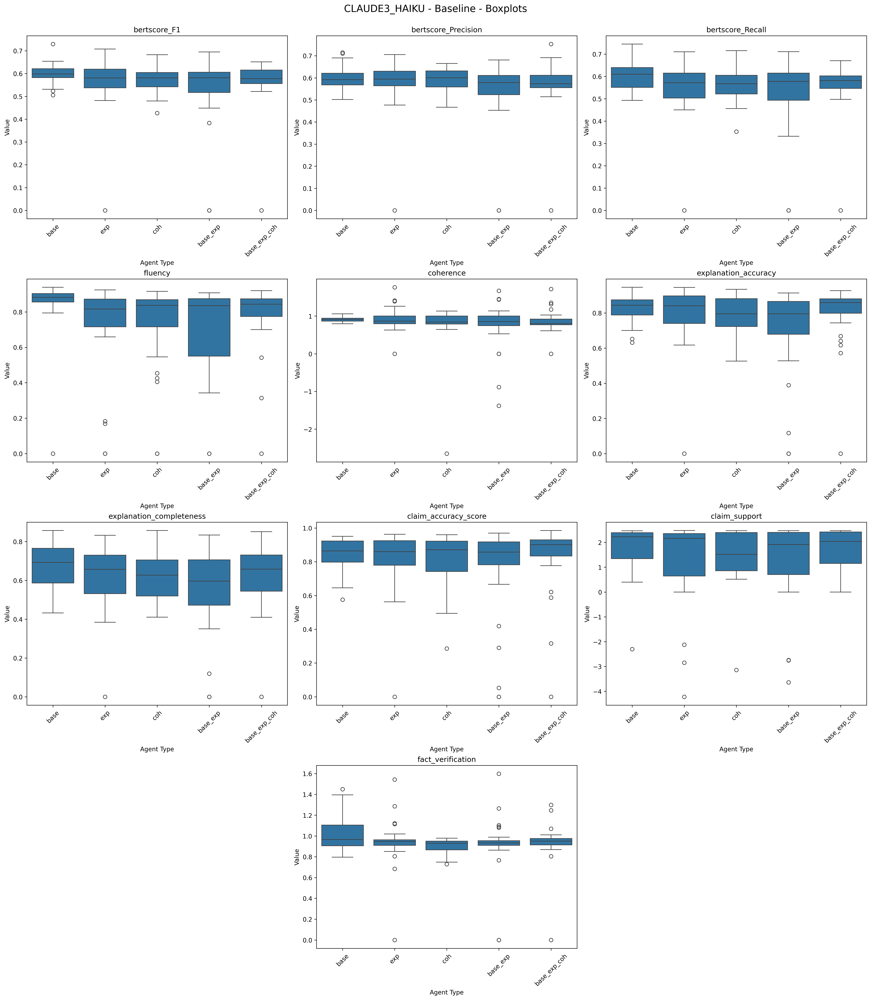
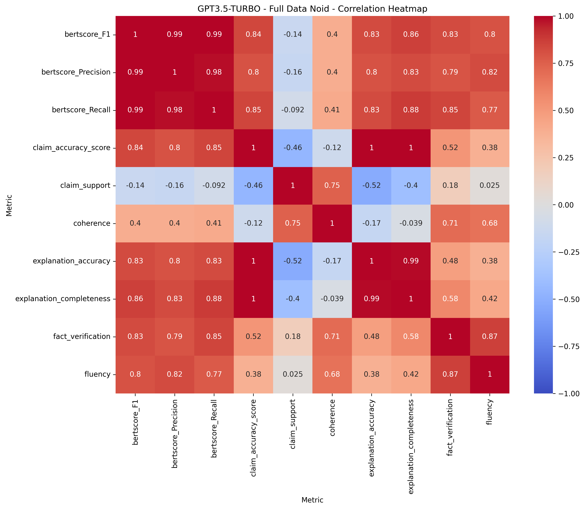
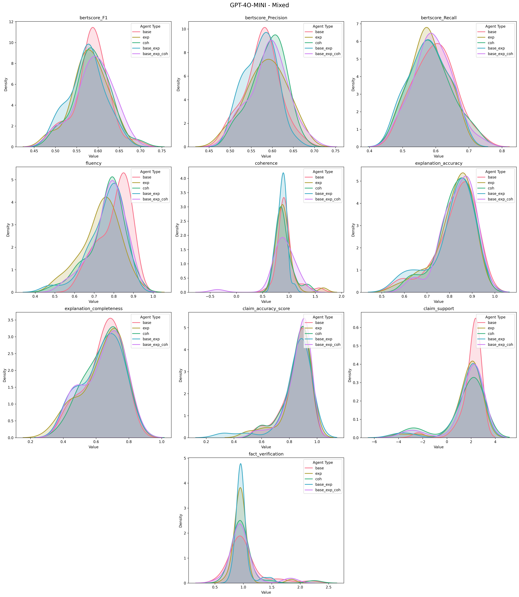
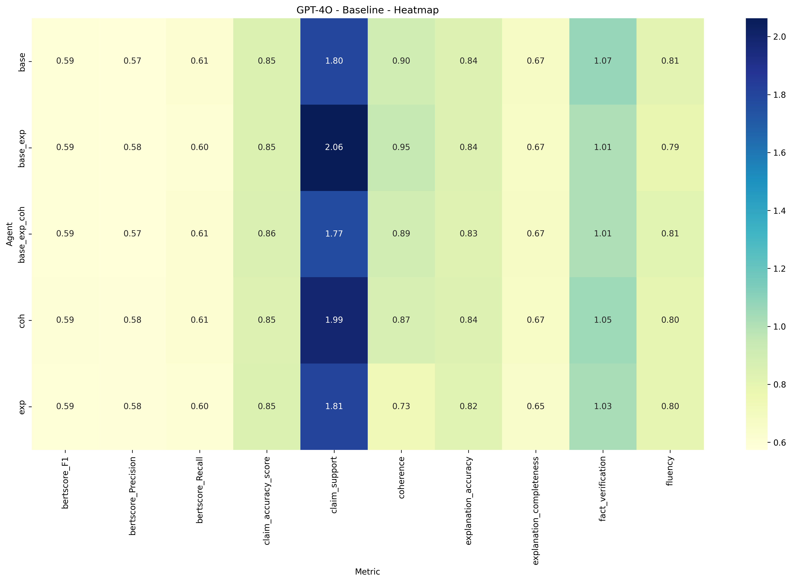
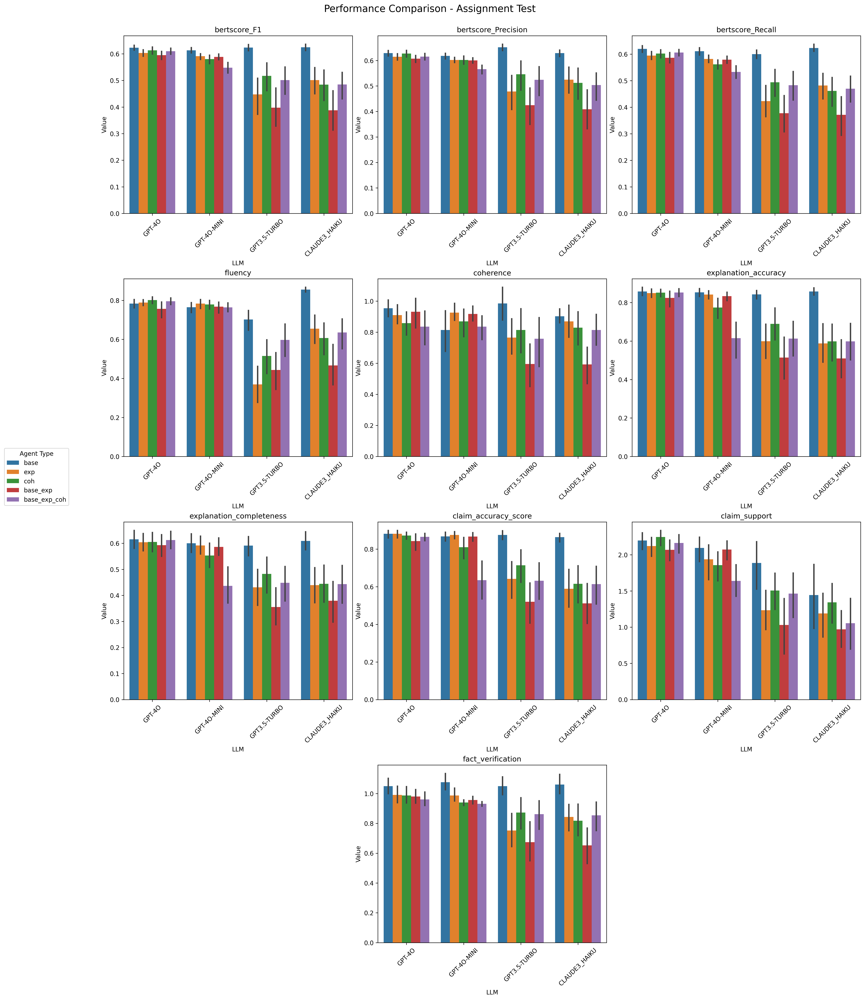
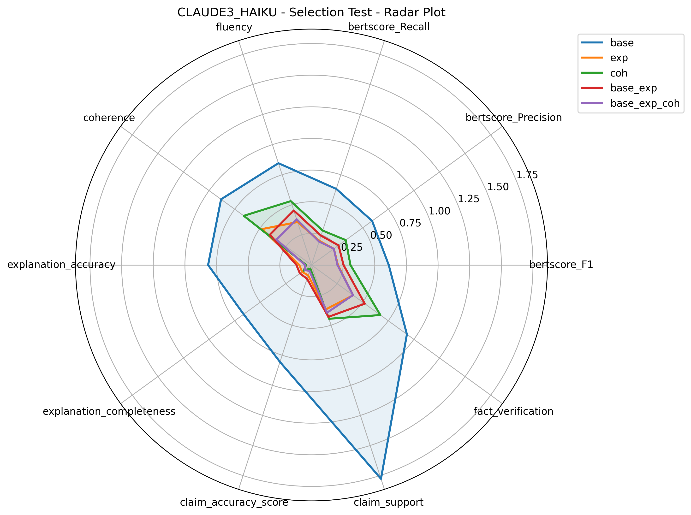

# DATA72000-IBE

## Overview

This README provides an overview of the `figures` folder within the repository. This folder is structured to organize various graphical representations and architectural diagrams produced for the project and/or report. This document will guide you through the folder structure, describe the contents of subfolders, and explain the main purposes of the files.

```bash
figures/
│
├── architectures/
│   ├── templates/
│   │   ├── mas.drawio
│   │   ├── r4c.drawio
│   │   ├── rag.drawio
│   │   ├── rag_task.drawio
│   │   ├── sas.drawio
│   │   └── sda.drawio
│   │
│   └── (same filenames as in templates, with `.drawio.png` extension)
│
└── graphs/
    ├── boxplots/
    │   ├── CLAUDE3_HAIKU/
    │   │   ├── assignment_test_boxplots.png
    │   │   ├── baseline_boxplots.png
    │   │   ├── full_data_noid_boxplots.png
    │   │   ├── missing_evidence_boxplots.png
    │   │   ├── mixed_boxplots.png
    │   │   ├── selection_test_boxplots.png
    │   │   └── wrong_evidence_boxplots.png
    │   ├── GPT-4O/
    │   ├── GPT-4O-MINI/
    │   └── GPT3.5-TURBO/
    │       └── (same file structure as CLAUDE3_HAIKU)
    │
    ├── correlation_heatmaps/
    ├── density_plots/
    ├── heatmaps/
    └── radar_plots/
        └── (same folder structure as boxplots for each model)
    │
    └── performance_comparison/
        ├── assignment_test_performance_comparison.png
        ├── baseline_performance_comparison.png
        ├── full_data_noid_performance_comparison.png
        ├── missing_evidence_performance_comparison.png
        ├── mixed_performance_comparison.png
        ├── selection_test_performance_comparison.png
        └── wrong_evidence_performance_comparison.png

```

## Subfolder Details

### Architectures Subfolder

The `architectures` subfolder contains diagrams representing different architectures or workflows used within the project. It includes both the original `.drawio` files and their corresponding exported `.png` images.

#### Structure and Files

- **templates/**: This folder contains the original `.drawio` files that define the architectural diagrams:

  ---
  - `mas.drawio`, `r4c.drawio`, `rag.drawio`, `rag_task.drawio`, `sas.drawio`, `sda.drawio`
  ---
  - Editable in [draw.io](draw.io) and represent used and future workflows/agents.
  
- **Exported Images**: The `.png` files are exported versions of the `.drawio` diagrams for easy viewing:

  ---
  - Corresponding images of the `.drawio` files: `mas.drawio.png`, `r4c.drawio.png`, `rag.drawio.png`, `rag_task.drawio.png`, `sas.drawio.png`, `sda.drawio.png`
  ---
  - Used for documentation and reporting throghout this repository.

### Graphs Subfolder

The `graphs` subfolder contains visual representations of various performance metrics and comparisons across different models and scenarios. This subfolder is further divided into specific types of visualizations.

#### Structure and Files

- **boxplots/**, **correlation_heatmaps/**, **density_plots/**, **heatmaps/**, **radar_plots/**: 
  - Each of these folders contains subfolders corresponding to different models (`CLAUDE3_HAIKU`, `GPT-4O`, `GPT-4O-MINI`, `GPT3.5-TURBO`).
  ---
  - Within each model-specific folder are `.png` files representing performance metrics under different testing scenarios: `assignment_test_*.png`, `baseline_*.png`, `full_data_noid_*.png`, `missing_evidence_*.png`, `mixed_*.png`, `selection_test_*.png`, `wrong_evidence_*.png`
  ---
  - The suffix indicates the type of visualization (e.g., boxplots, radar plots).

- **performance_comparison/**: 
  - This folder includes aggregate comparison plots that evaluate model performance across all language models.
  ---
  - Files follow a similar naming convention (`*_performance_comparison.png`) and represent aggregate comparisons for different test scenarios.

### Example `graphs/` Files

Below are examples of the contents within each of the subfolders to illustrate them:

#### Example from `boxplots/CLAUDE3_HAIKU/`

- **baseline_boxplots.png**: Shows boxplot distributions for the baseline scenario, comparing metrics like BERTScore, fluency, and explanation accuracy across various agents.

---

<div align="center">
    
    <p><strong>Figure 1:</strong> Boxplots for Evaluation Metrics for CLAUDE3 HAIKU for all 5 tested Agents (Baseline Test)</p>
</div>

---

#### Example from `correlation_heatmaps/GPT3.5-TURBO`

- **full_data_noid_correlation_heatmap.png**: Shows correlation heatmap between metrics for the R4C scenario, comparing all used metrics against each other.

---

<div align="center">
    
    <p><strong>Figure 2:</strong> Corr. Heatmap for Evaluation Metrics for GPT3.5 TURBO for all 5 tested Agents (R4C Test)</p>
</div>

---

#### Example from `density_plots/GPT-4O-MINI`

- **mixed_density_plots.png**: Shows density plots for all metrics for the mixed evidence scenario, using GPT-4o-mini as the LLM agent.
---

<div align="center">
    
    <p><strong>Figure 3</strong> Density Plots for Evaluation Metrics for GPT-4O MINI for all 5 tested Agents (Mixed Test)</p>
</div>

---

#### Example from `heatmaps/GPT-4O`

- **baseline_heatmap.png**: Shows a heatmap comparison for all tested metrics for the baseline evidence scenario, using GPT-4o as the LLM agent.
---

<div align="center">
    
    <p><strong>Figure 4</strong> Heatmaps for Evaluation Metrics for GPT-4O for all 5 tested Agents (Baseline Test)</p>
</div>

---

#### Example from `performance_comparison/`

- **assignment_test_performance_comparison.png**: A performance comparison plot aggregating all models under the assignment test scenario, showing relative performance across metrics.

---

<div align="center">
    
    <p><strong>Figure 5:</strong> Performance Comparison for Evaluation Metrics for all LLMs, for all 5 tested Agents (Assignment Test)</p>
</div>

---

#### Example from `radar_plots/CLAUDE3_HAIKU`

- **selection_test_radar_plot.png.png**: Shows a radar plot comparison for all tested metrics for the selection test scenario, using Claude 3 Haiku as the LLM agent.
---

<div align="center">
    
    <p><strong>Figure 6</strong> Radar plot for Evaluation Metrics for Claude 3 Haiku for all 5 tested Agents (Selection Test)</p>
</div>

---


> ***Note:*** The `graphs/` folder contains very roughly processed results as the graphs are meant to showcase what the data looks like and how can be used, and are meant to support the findings further rather than be discussion points on their own.

### Example Table

Below is an example of contents within the `tables.ipynb` notebook to see what can be expected:

---

<div align="center">
<p><strong>Table 1: GPT3.5-TURBO - Baseline Test Averages</strong></p>

<table>
<tr>
<th>Metric</th><th>Base</th><th>EXP</th><th>COH</th><th>Base+EXP</th><th>Base+EXP+COH</th><th><strong>Relative Gain</strong></th>
</tr>
<tr><td>BERTScore (F1)</td><td>0.5097</td><td>0.5409</td><td>0.4091</td><td>0.5112</td><td><u>0.5500</u></td><td><strong>7.91%</strong></td></tr>
<tr><td>BERTScore (Precision)</td><td>0.5158</td><td>0.5499</td><td>0.4191</td><td>0.5210</td><td><u>0.5589</u></td><td><strong>8.34%</strong></td></tr>
<tr><td>BERTScore (Recall)</td><td>0.5066</td><td>0.5344</td><td>0.4012</td><td>0.5038</td><td><u>0.5438</u></td><td><strong>7.33%</strong></td></tr>
<tr><td>Fluency</td><td>0.6242</td><td><u>0.7169</u></td><td>0.5228</td><td>0.6770</td><td>0.7071</td><td><strong>14.86%</strong></td></tr>
<tr><td>Coherence</td><td>0.8110</td><td>0.6757</td><td>0.6489</td><td>0.5018</td><td><u>0.8753</u></td><td><strong>7.92%</strong></td></tr>
<tr><td>Explanation Accuracy</td><td>0.6946</td><td><u>0.7477</u></td><td>0.5919</td><td>0.7141</td><td>0.7887</td><td><strong>13.56%</strong></td></tr>
<tr><td>Explanation Completeness</td><td>0.5461</td><td>0.5993</td><td>0.4455</td><td>0.5561</td><td><u>0.6077</u></td><td><strong>11.28%</strong></td></tr>
<tr><td>Claim Accuracy</td><td>0.7264</td><td>0.7692</td><td>0.6225</td><td>0.7436</td><td><u>0.7950</u></td><td><strong>9.44%</strong></td></tr>
<tr><td>Claim Support</td><td>1.6526</td><td>1.5675</td><td>1.1790</td><td><u>1.6814</u></td><td>1.6293</td><td><strong>1.74%</strong></td></tr>
<tr><td>Fact Verification</td><td>0.8975</td><td>0.8762</td><td>0.6495</td><td>0.8519</td><td><u>0.9216</u></td><td><strong>2.68%</strong></td></tr>
</table>
</div>
---

> ***Note***: The figures/tables above ***might not*** be the exact ones found in the main report as they are complete representations of all data/metrics and are used for showcasing reasons rather than concise report writing.


### Jupyter Notebooks

The `graphs.ipynb` and `tables.ipynb` notebooks within automate the generation of aforementioned graphs and tables:

- **graphs.ipynb**: Generates visualizations for various metrics across different models and scenarios, saving them into the appropriate folders.

- **tables.ipynb**: Processes results and generates formatted tables for easy comparison of performance metrics across different agents and scenarios.

> ***Note:*** For more detailed information on the generation and analysis of these figures, please refer to the respective notebooks.
