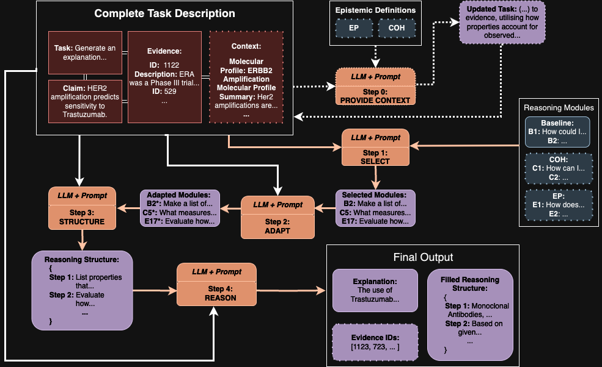

# DATA72000-IBE

## Overview

This `README` provides details about the contents of the models folder within this repository. This folder is organized into a subfolder and `Python` files that implement the reasoning and question-answering capabilities of the project. This `README` aims to briefly explain the structure of these components, the purpose of the different files within them, and provide basic examples for clarity.

## Folder Structure

```bash
models/
│
├── reasoning_modules/
│   ├── baseline.json
│   ├── coherence.json
│   └── explanatory.json
│
├── rag.py
└── sda.py
```

## General Usage
To see how these frameworks can be used in seperation, please see `../utils/playground.ipynb` for worked examples for each alongside their outputs. For more general overview, please refer to the sections below. For more in-depth understanding, please refer to the source files or original papers.

## Reasoning Modules Subfolder
The `reasoning_modules` subfolder contains JSON files that define different reasoning modules used in the `Self-Discover` framework. These modules aim to improve the reasoning capabilities of the system by applying and utilising various epistemic notions alongside a selection of original (`baseline.json`) modules.

### Structure and Files

- **`baseline.json`**: Contains selected baseline thinking modules from the `Self-Discover` paper. These serve as baseline reasoning strategies for evaluating the performance of other modules and their combinations. Some original modules were dropped due to irrelevance to the task (like `"Try creative thinking, generate innovative (...)"` or `"Seek input and collaboration from others (...)"`) in order to minimise confusion due to longer contexts, to reduce API costs, and to ensure fairness between modules (same number of options).

- **`explanatory.json`**: Specifies reasoning modules that emphasize explanatory power. These are designed to provide deeper explanations that clarify cause-effect relationships and underlying principles of a given system. Those were kept relatively simple to fit the original modules style and formatting.

- **`coherence.json`**: Defines reasoning modules based on the concept of coherence. These modules focus on maintaining logical consistency throughout the reasoning process and among the evidence chosen. Again, those were kept relatively simple and brief.

For both concepts, please see the referenced papers for more information.

### Examples of Modules:

#### baseline.json
---
```json
{
    "B1. How could I devise an experiment to help solve that problem?",
    "B2. Make a list of ideas for solving this problem, and apply them one by one to the problem to see if any progress can be made",
    "B3. How could I measure progress on this problem?",
    ...
}
```
---

#### explanatory.json

```json
{
    "E1. Compare the explanatory power of multiple hypotheses for the same set of evidence. Which one is superior?",
    "E2. Does the hypothesis reduce the surprise associated with the evidence?",
    "E3. What are the key factors that determine the explanatory power of a hypothesis?",
    ...
}
```
---
#### coherence.json
```json
{
    "C1. How can I determine if a set of beliefs or propositions are coherent with each other?",
    "C2. Identify the logical, explanatory, and probabilistic relationships between the beliefs in this set.",
    "C3. Evaluate whether the addition of new evidence affects the coherence of existing hypotheses.",
    ...
}
```

## Python Files
This folder also includes two `Python` files, `sda.py` and `rag.py`, which implement adapations of aforementioned frameworks, `Self-Discover` and `Self-RAG`, accordingly.

### `sda.py`
Contains the implementation of the `Self-Discover` framework adapted for LLMs and Epistemic Notions.

#### Key Components

- **SelfDiscovery Class**: Implements the core of the system for explanation-generation using language models from either OpenAI or Anthropic and chosen reasoning modules.
  
- **Core Methods**:
  - **Initialization**: Sets up the system with required parameters and reasoning modules.
  - **Loading Prompts**: Loads and processes prompts to guide the reasoning tasks.
  - **Workflow Graph Creation**: Constructs a workflow graph representing the sequence of reasoning steps.
  - **Task Solving**: Solves tasks through iterative intermediate steps.

The general SDA workflow can be seen in the figure below:

<div align="center">
  
  <p><em>Figure 1: Adapted Self-Discover framework workflow</em></p>
</div>

In general, the process can be described as follows:

- **`Step 0: Adjusting Task Contextually`**: If either EXP or COH (or both) modules were selected, the model adjusts the task by introducing brief definitions of selected notions into the task description.
- **`Step 1: Selecting Modules`**: Given the complete (adjusted or not) task statement, the model selects from available/selected reasoning modules based on what it believes would help it solve the task best.
- **`Step 2: Adapt Selected Modules`**: Again, based on the complete task statement, the model adjusts the chosen reasoning modules to fit the task at hand better.
- **`Step 3: Structure Reasoning`**: Model implements a step-by-step reasoning structure with adapted reasoning modules imbued in the steps.
- **`Step 4: Task Reasoning`**: The model uses previously developed reasoning structure to solve the task and produce the final answer/output.

It is worth noting that `"Step 0"` was not in the original `Self-Discover` paper and was introduced into this project to further help the LLMs when dealing with, often complex and novel to them, epistemic notions. Similarly, `EXP` and `COH` modules were other additions to the framework.

For more information regarding more in-depth overview, prompts used, and structure, please refer to the main `report.pdf`, the original `Self-Discover` paper, or the `sda.py` source file.

#### Example Usage

```python
# Python Code
from sda import SelfDiscovery

# Initialize the SelfDiscovery class with desired parameters
sda = SelfDiscovery(
    model_type="openai", # can also be anthropic
    model_name="gpt-3.5-turbo", # can be any model from Anthropic/OpenAI API
    use_base=True,
    use_exp=False,
    use_coh=True, # at least one (base, exp, coh) module must be used, but otherwise any combination is allowed
    modules_path="./reasoning_modules"
)

# Test task (simple example)
task = ("Evaluate the claim: 'Regular excercise increases the risk of Lung Cancer.', ", 
            "state either 'True' or 'False'.")

# Stream the Output
print("SelfDiscovery Workflow Steps:")
for step in sda.solve_stream(task):
    print("\n" + "="*50)
    for key, value in step.items():
        print(f"Step: {key}")
        if isinstance(value, dict):
            for k, v in value.items():
                if k in ["reasoning_modules", "selected_modules", "adapted_modules", "reasoning_structure", "answer"]:
                    print(f"  {k}: {v[:100]}...")  # first 100 characters
                else:
                    print(f"  {k}: {v}")
        else:
            print(f"  Output: {value}")
    print("="*50)

# ============================ OR ============================

# Get Final Solution
solution = sda.solve(task)
print("\nFinal Solution:")
print(json.dumps(solution, indent=2)) # can skip json formatting
```

### `rag.py`
Dfines the `SelfRAG` class, which implements a self-reflective Retrieval-Augmented Generation (RAG) system for question answering.

#### Key Components

- **SelfRAG Class**: Combines retrieval and generation functions to answer questions using LLMs and embeddings.
  
- **Core Methods**:
  - **Document Loading and Vectorization**: Loads, prepares, and stores a knowledgebase relevant to the task.
  - **Workflow Graph Creation**: Similar to `sda.py`, creates a graph for managing the sequence of RAG processes.
  - **Answer Generation and Evaluation**: Generates answers and evaluates them for quality and usefulness.
  - **Retrieval and Grading**: Retrieves documents and grades them based on relevance (here, top k=5).
  - **Query Transformation**: Modifies queries based on initial responses to improve queries.
  - **Evidence Retrieval**: Retrieves relevant evidence to support generated answers.

The general RAG workflow can be seen in the figure below:

<div align="center">
  
  <p><em>Figure 2: Adapted RAG framework workflow</em></p>
</div>

In general, the process can be described as follows:
- **`1. Document Retrieval`**: Top K (in current implementatio K=5) documents are retrieved based on embedding relevance.
- **`2. Checking for Relevance`**: If given LLM finds no documents relevant, the original question is transformed and process starts anew, otherwise process continues.
- **`3. Answer Generation`**: LLM generates an answer to the (transformed or not) question based on relevant documents.
- **`4. Check for Hallucinations`**: LLM checks if answer is based purely on documents provided, or if some parts were hallucinated. If hallucination was noticed, the model generates another answer, otherwise the process continues.
- **`5. Check for Usefulness`**: LLM checks if the generated answer is useful regarding the questions asked. If it's useful, the model produces its final output (evidence and their IDs); if not, the model transform the question and starts anew.

It is worth noting that the `TRANSFORM QUESTION` can technically occur infinitely, however, for the purposes of this project, the limit was set at `1 Transformation per Question`. After that step if the model cannot generate reasonable output, nothing is returned. Similarly, any method of `Document Retrieval` could be implemented, but here it was decided that simplest `Top K (=5) relevant` was good enough.

Again, for more information please refer to the main `report.pdf`, the original `Self-RAG` paper, or the `rag.py` source file.

#### Example Usage

```python
# Python Code
from rag import SelfRAG

# Initialize SelfRAG
rag = SelfRAG(llm_model="gpt-4o-mini", embedding_model="text-embedding-3-small") # via OpenAI API
# Supports any GPT or Claude model via their APIs, but only OpenAPI embeddings
rag.load_documents("../data/CIVIC/clean/evidence_kb.json")

# Test question
question = "What are the effects of crizotinib on lung adenocarcinoma?"

# Stream the Output
inputs = {"question": question, "documents": [], "generation": "", "evidence": [], "transform_count": 0}

print("\nWorkflow steps:")
for output in rag.workflow.stream(inputs):
    print("\n" + "="*50)
    for key, value in output.items():
        print(f"Step: {key}")
        if isinstance(value, dict):
            for k, v in value.items():
                if k == "documents":
                    print(f"  {k}: {len(v)} documents")
                elif k == "generation":
                    print(f"  {k}: {v[:100]}...")  # first 100 characters of generation
                else:
                    print(f"  {k}: {v}")
        else:
            print(f"  Output: {value}")
    print("="*50)

# ============================ OR ============================

# Get Final Solution
relevant_evidence = rag.get_relevant_evidence(question)
print("\nFinal Evidence:")
print(relevant_evidence)
```