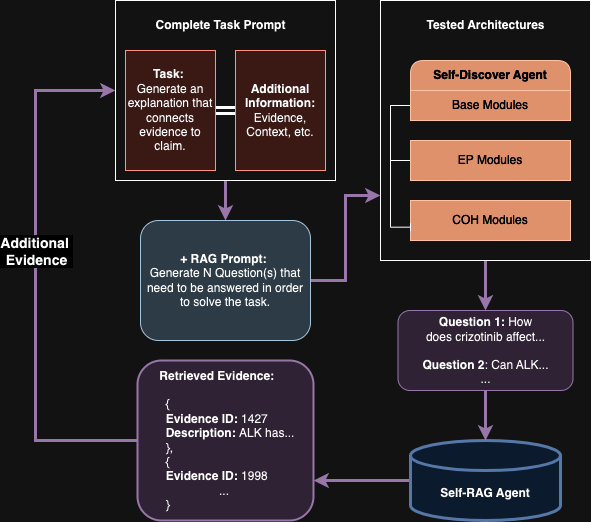

# DATA72000-IBE

## Overview

This `README` provides details about the contents of the `outputs` folder within this repository. This folder is divided into three subfolders: `Anthropic`, `OpenAI`, and `notebooks`. Each subfolder contains specific outputs or testing files relevant to different models and testing scenarios. This `README` explains the structure of these subfolders, the purpose of the different files within them, and provides some examples for clarity.

## Folder Structure

```bash
outputs/
│
├── Anthropic/
│   └── claude3_haiku/
│       ├── base/
│       │   ├── assignment_test.json
│       │   ├── baseline.json
│       │   ├── full_data_noid.json
│       │   ├── missing_evidence.json
│       │   ├── mixed.json
│       │   ├── selection_test.json
│       │   └── wrong_evidence.json
│       ├── base_exp/
│       │   └── (same file structure as in base/)
│       ├── base_exp_coh/
│       │   └── (same file structure as in base/)
│       ├── coh/
│       │   └── (same file structure as in base/)
│       └── exp/
│           └── (same file structure as in base/)
│
├── OpenAI/
│   ├── gpt-4o/
│   │   ├── base/
│   │   ├── base_exp/
│   │   ├── base_exp_coh/
│   │   ├── coh/
│   │   └── exp/
│   │       └── (same file structure as in claude3_haiku/{base/exp/...}/)
│   ├── gpt-4o-mini/
│   │   ├── base/
│   │   ├── base_exp/
│   │   ├── base_exp_coh/
│   │   ├── coh/
│   │   └── exp/
│   │       └── (same file structure as in claude3_haiku/{base/exp/...}/)
│   └── gpt3.5-turbo/
│       ├── base/
│       ├── base_exp/
│       ├── base_exp_coh/
│       ├── coh/
│       └── exp/
│           └── (same file structure as in claude3_haiku/{base/exp/...}/)
│
└── notebooks/
    ├── gpt3.5-turbo_tests.ipynb
    ├── gpt4o_tests.ipynb
    ├── gpt4omini_tests.ipynb
    ├── haiku_tests.ipynb
    └── sonnet_tests.ipynb
```

## General Usage

Each subfolder (`Anthropic`, `OpenAI`, and `notebooks`) is organized to provide outputs and testing files relevant to different models and scenarios. The `Anthropic` and `OpenAI` subfolders contain directories for various models and agent types, each with a set of JSON files representing different testing scenarios. The `notebooks` subfolder includes Jupyter notebooks used for running tests on these models. These notebooks provide all necessary steps for testing and evaluating the models across various agent types and scenarios. Please refer to these notebooks in parallel with this `README` when accessing this folder for the first time, as they include steps necessary for understanding and replicating the results. A brief guide to navigating these subfolders and their contents has been provided below for ease in accessing and using the files effectively.

## Testing Workflow

The testing process can be seen in the figure below:

<div align="center">
  
  <p><em>Figure 1: The testing process as used in notebooks</em></p>
</div>

The evidence retrievel from the RAG can be seen in figure below:

<div align="center">
  
  <p><em>Figure 2: The evidence retrieval step</em></p>
</div>

In general, the testing workflow can be described as follows:

---
- **`1. Additional Evidence Retrieval (Optional)`**: Only used for `missing_evidence.json` and `mixed.json` scenarios. Here, the chosen Agent architecture is tasked with generating `N` questions to be answered by `RAG` agent. If any evidence was retrieved, it is added into existing evidence set, while ensuring only unique entries are present.
---
- **`2. Explanation Generation`**: The Agent then receives complete task prompt, alongside relevant claim(s) and evidence, and is asked to complete the specific task and generate an output.
---
- **`3. Output Extraction`**: The generated output is then extracted via LLM-assisted Regex and stored in a JSON format in relevant subfolder.
---

> **Note:** For all tests, `N=2` questions were generated for relevant tasks. The number was chosen as an optimal middle-ground between all agent architectures. All Agents used the exact same RAG Agent. Moreover, only `30` Test Cases were chosen for tests from each scenario. For more information about RAG, please refer to the `models/` folder. For more information about the testing engine or prompts used for different tasks, refer to the `utils/` folder. 

## Anthropic Subfolder

The `Anthropic` subfolder contains outputs generated from different agents using the Claude3 Haiku model. These outputs are categorized into different agent types within the `claude3_haiku` folder, representing various combinations of reasoning modules.

### Structure and Files

- **claude3_haiku/**: This folder is divided into five subfolders, each representing a different agent type used in testing:

  ---
  - **base/**: Contains outputs from the Agent with baseline reasoning modules.
  ---
  - **exp/**: Contains outputs from the Agent with Explanatory Power modules.
  ---
  - **coh/**: Contains outputs from the Agent with Coherence modules.
  ---
  - **base_exp/**: Contains outputs from the Agent with Baseline + EXP modules.
  ---
  - **base_exp_coh/**: Contains outputs from the Agent with Baseline + EXP + COH modules.
  ---

### File Descriptions

Each subfolder contains the following JSON files, which are outputs from different scenarios:

---
- **baseline.json**: Outputs from scenarios where all evidence is present.
---
- **missing_evidence.json**: Outputs from scenarios where some evidence is missing.
---
- **wrong_evidence.json**: Outputs from scenarios where the parts of evidence provided are incorrect.
---
- **mixed.json**: Outputs from scenarios where the parts of evidence provided are incorrect, and some are missing.
---
- **selection_test.json**: Outputs from the selection test scenario.
---
- **assignment_test.json**: Outputs from the assignment test scenario.
---
- **full_data_noid.json**: Similar to `baseline.json`, but based on `R4C` data.

> **Note:** The details about each scenario file, reasoning modules, and architectures used in agents can be found in the `data/` and `models/` folders' `READMEs`, respectively.

## OpenAI Subfolder

The `OpenAI` subfolder contains outputs generated from different LLMs from OpenAI, such as GPT-3.5 and GPT-4 variations. These outputs are structured similarly to the `Anthropic` subfolder and are organized by the specific model used.

### Structure and Files

- **gpt-4o/**: Contains outputs from the GPT-4o model.
- **gpt-4o-mini/**: Contains outputs from a smaller version of the GPT-4o model.
- **gpt3.5-turbo/**: Contains outputs from the GPT-3.5 Turbo model.

### File Descriptions

Each subfolder contains the same set of JSON files as the `Anthropic` subfolders, representing outputs for various scenarios tested with these models.

## Example Files
As the file structures remain the same for all subfolders, only three file examples are provided as they represent the schemas for all relevant JSONs.

---
### baseline.json, missing_evidence.json, wrong_evidence.json, mixed.json, full_data_noid.json - referred to as `"explanation"` task type
These files all share the same structure:

```json
  {
    "generated_explanation": "The claim that HER2 amplification (...) resistant cases."
  },
  {
    "generated_explanation": "The claim that lung adenocarcinoma (...) in treatment planning."
  },
  ...

```
---
### selection_test.json - referred to as `"selection"` task type

```json
  {
    "selected_claim": "A",
    "generated_explanation": "The evidence strongly (...) the available data."
  },
  {
    "selected_claim": "A",
    "generated_explanation": "The evidence supports (...) evidence in the provided data."
  },
  ...

```
---
### assignment_test.json - referred to as `"assignment"` task type
```json
  {
    "claim_A": {
      "generated_explanation": "The evidence strongly (...) rare pediatric cancer."
    },
    "claim_B": {
      "generated_explanation": "The evidence supports (...) this specific genetic profile."
    }
  },
  {
    "claim_A": {
      "generated_explanation": "The F76del variant (...) pathogenicity for the F76del variant."
    },
    "claim_B": {
      "generated_explanation": "Rearrangements involving MYB or (...) diffuse astrocytoma."
    }
  },
  ...
```
---
## Notebooks Subfolder

The `notebooks` subfolder contains Jupyter notebooks used for conducting and replicating tests on different models and scenarios. These notebooks utilize an automatic tester found in the `../utils/` folder to run tests and extract explanations.

### Notebooks

- **gpt4o_tests.ipynb**: Notebook for testing GPT-4o outputs.
---
- **gpt4omini_tests.ipynb**: Notebook for testing GPT-4o-mini outputs.
---
- **gpt3.5-turbo_tests.ipynb**: Notebook for testing GPT-3.5 Turbo outputs.
---
- **haiku_tests.ipynb**: Notebook for testing Claude model outputs.
---
- **sonnet_tests.ipynb**: Another notebook used for testing similar models **`(UNUSED)`**.

> **Note:** Refer to these notebooks to rerun the tests or to see detailed steps on how the tests were conducted or see exact model snapshots used. Also refer to `../utils/automatic_tester.py` to understand the process better if needed, and see relevant prompts used for different tasks (also see the main `report.pdf`).